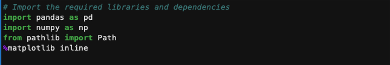
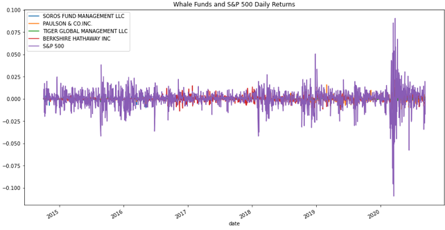
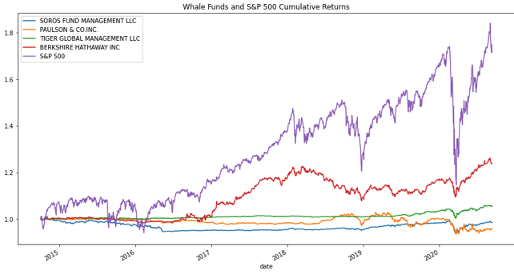
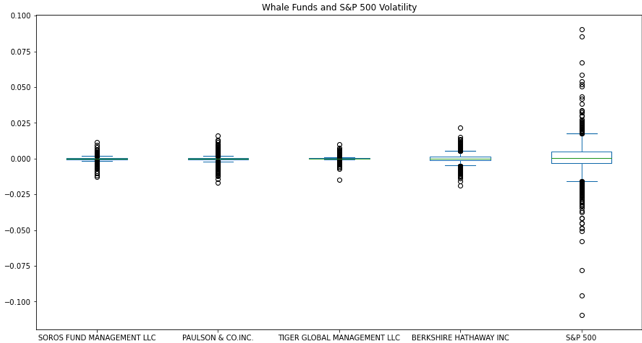
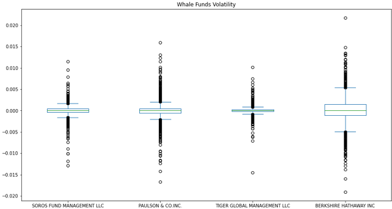
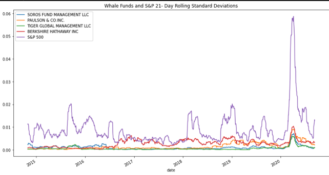
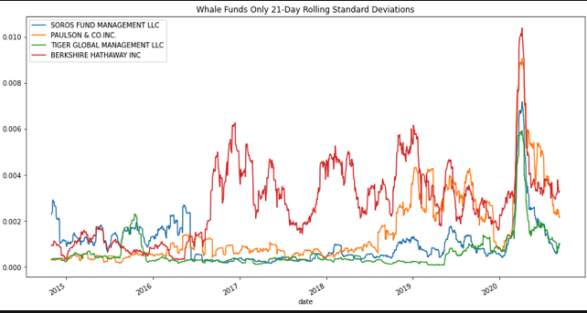
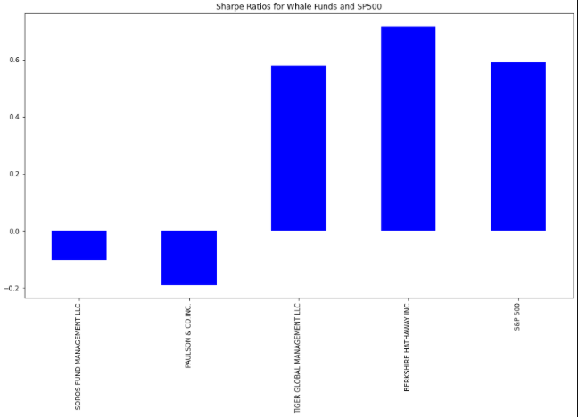
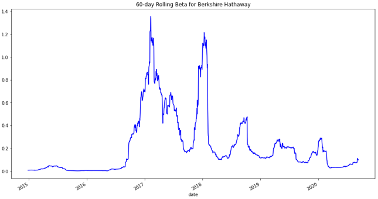
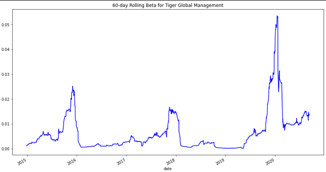

# risk_return_analysis

This application evaluates four portfolios against the S&P 500 using variance, standard deviations, Sharpe's ratio, and beta to select among them for inclusion in the firm's portfolio offerings.

---

## Technologies

This application runs in a Jupyter Notebook.  

It imports pandas, numpy, Path from pathlib, and matplotlib.

---

## Installation Guide

No installation is required, other than loading in Jupyter Notebook.  To do so, navigate to the directory containing the notebook in terminal or GitBash.  There, type `jupyter lab`.  Then, on the right side of the notebook click on risk_return_analysis.ipynb

---

## Usage

After reading in the data from the CSV, the application presents you with the initial data from the portfolios.

Then, the application calculates the daily return for the different portfolios so as to allow the comparison of differently priced assets.

For comparison, the app provides the cumuliative returns for the portfolios.

As the first filter for evaluating the portfolios, the app compares the volatility for the portfolios.  First with S&P 500 included and then without to allow for a more clear view of the investor portfolios.

Then, the standard deviations for the portfolios is displayed.  Again with the first including the S&P 500, the second omitting it to allow a better comparison.

Next, the Sharpe's ratio is calculated.

From this, we can determine that the best two portfolios are Berkshire Hathaway and Tiger Global Managment.  To better choose between the two, we can evaluate the beta of the stocks.  Those charts are included below.

---

## Contributors

This project was created as a part of the Rice FinTech Bootcamp.

---

## License

This software is licensed for use under the included MIT License.
